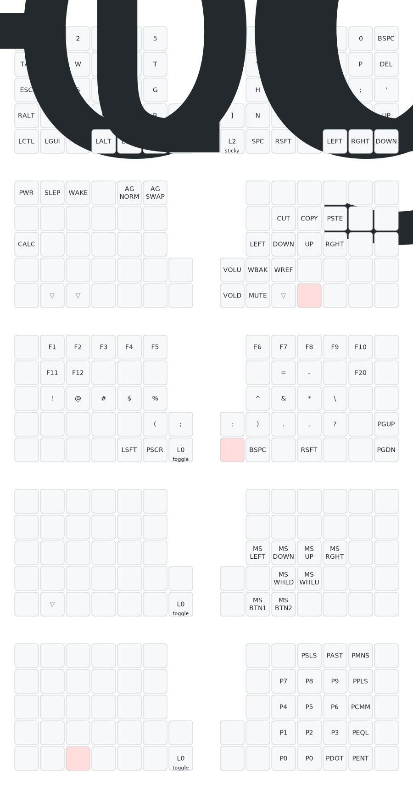

# Custom firmware for my QMK keyboard

This is my custom keymaps using the [userspace](https://docs.qmk.fm/#/feature_userspace) feature from QMK.

## Modifying layout

1. Load `coaxial.json` into [QMK Configurator](https://config.qmk.fm/) (or
   select load from URL with
   `https://raw.githubusercontent.com/coaxial/qmk_keymap/master/coaxial.json`)
2. Edit keys
3. Download updated json file and overwrite `coaxial.json` in the repo
4. Commit using a [semantic-commit message](https://github.com/angular/angular/blob/main/contributing-docs/commit-message-guidelines.md) via PR
5. Merge PR

## Keymap Layout

## Flashing new firmware on keyboard

1. Setup the [QMK CLI](https://docs.qmk.fm/#/newbs_getting_started?id=set-up-your-environment)
2. Download latest firmware file from the [releases page](https://github.com/coaxial/qmk_keymap/releases)
3. Flash with `cd <qmk_firmware repo> && qmk flash <path/to/firmware>` (must be
   run within `qmk_firmware` repo)

> `qmk/qmk_firmware` can be quite large and slow to `cd` into. Make a shallow
> clone with `git clone https://github.com/qmk/qmk_firmware --depth 1` and run
> `qmk doctor` within the directory to set submodules up.

> ⚠️ For split keyboards, both sides must be flashed individually.
